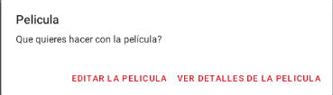
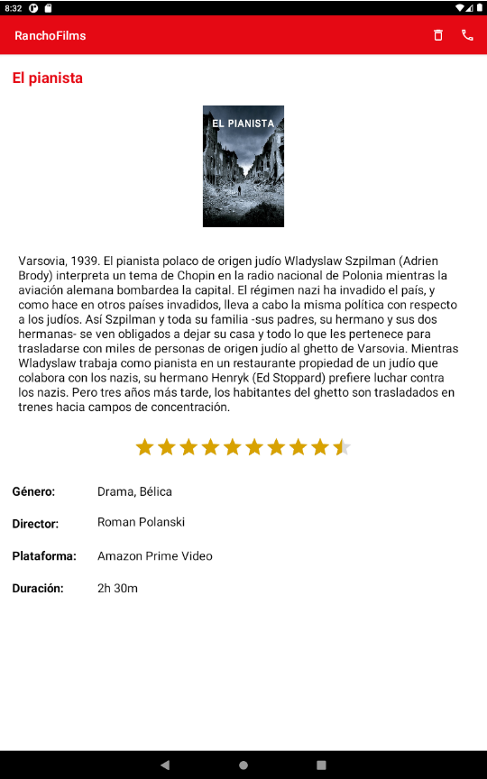

# SaulBlancoLopezProyectoPMDM
## Aplicación de Creación, agregación, eliminación, actualización y consulta de películas

### Creación de cuenta:
En esta pantalla se crea la cuenta con la que vamos a trabajar en la app, te logueas contra los SharedPreferences con un usuario y una contraseña.

### Inicio de sesión:
En esta pantalla se inicia la sesión para comenzar a trabajar con la app

### Lista de películas:
Se muestra una lista de películas en la que hay varias funcionalidades:

- Creación: Hay un FloatingActionButton en el que podemos Añadir una película
- Pulsando sobre una pelicula aparece un AlertDialog para elegir entre dos funciones:

    - Editar película: Permite editar las características de una película.
    - Ver detalles película: Muestra los detalles de la película.

### Ver detalles de la película:
Se muestran todas las características de la película y permite borrar la película y llamar al director

